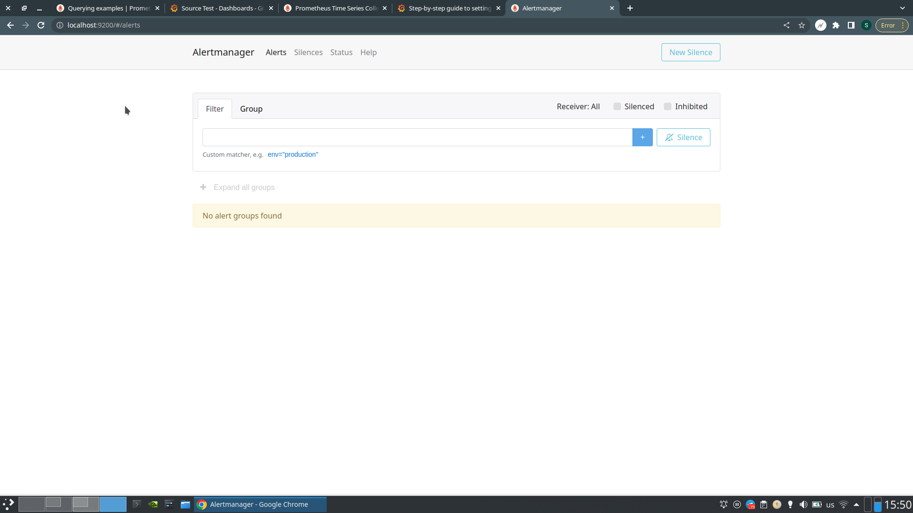
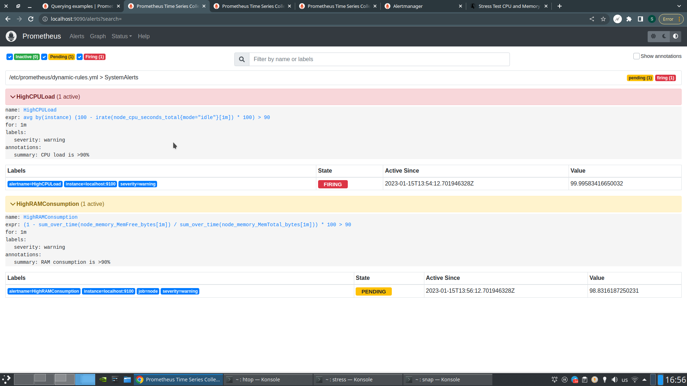
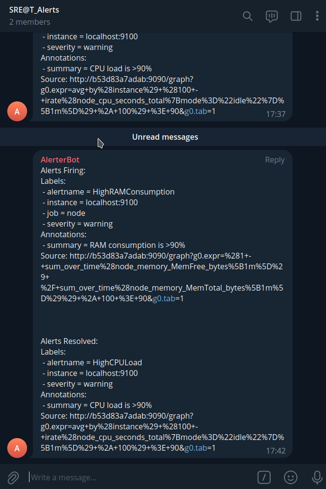

# HW 10

## Установка Alertmanager

Установка производится скриптом `install.sh`. Прикладываю скриншот с первого
запуска:


## Добавление алертов

Сделал 2 простых системных алерта (warning):
1. На высокую загрузку CPU (>90%)
2. На высокое потребление RAM (>90%)

Правила записаны в `dynamic-rules.yml`. Алерты триггерятся командами:

```bash
stress --cpu 16
stress-ng --vm-bytes $(awk '/MemAvailable/{printf "%d\n", $2 * 0.93;}' < /proc/meminfo)k --vm-keep -m 1
```

Прикладываю скриншот Prometheus со сработавшими алертами:


После двух минут триггера обоих алертов у меня умер докер, и всё развалилось. Это значит, что
ситуация была действительно важная и требовала немедленных действий.

## Нотификация в Telegram

Апнутый конфиг алертменеджера: `alertmanager.yml`. Прикладываю скриншот
телеграма с сообщением от бота:

