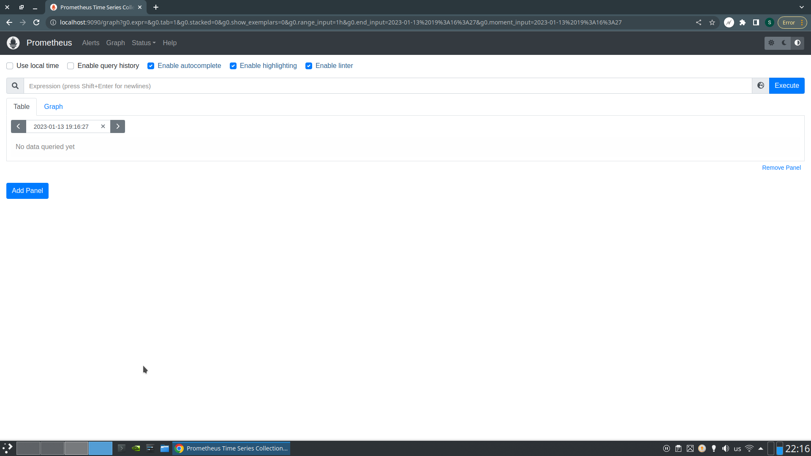
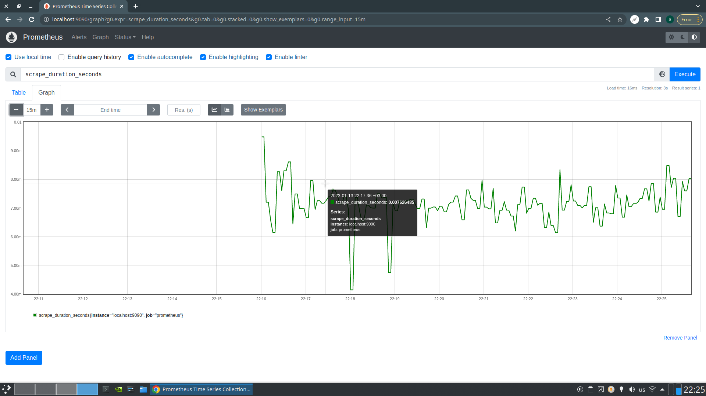
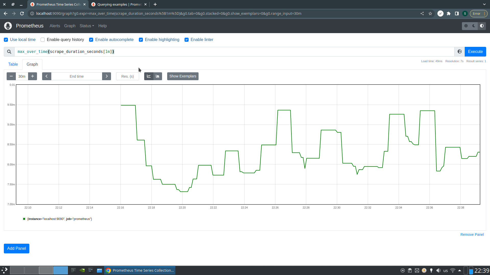
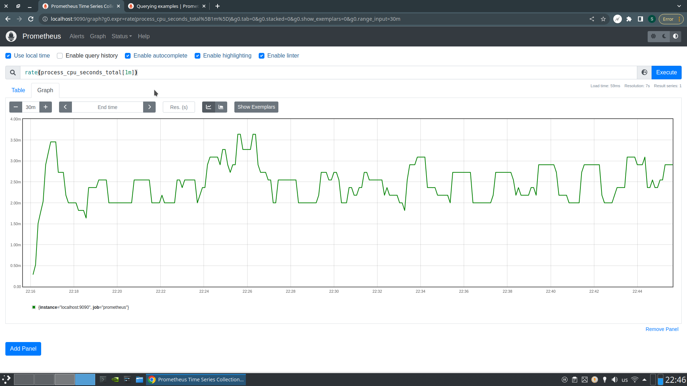
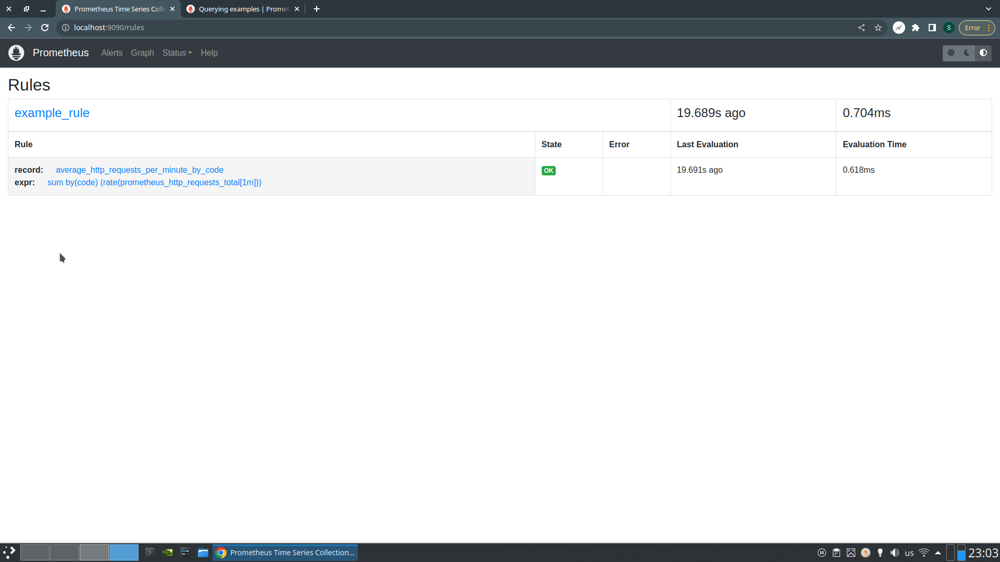

# HW 2

## Установка Prometheus

Все команды в скрипте `install.sh`. Прикладываю скриншот после первого
запуска.
`prometheus-first-run.png`

## Демонстрация PromQL
Сначала просто посмотрим на метрику scrape_duration - время на один подсос метрик:


Самый большой scrape duration за последнюю минуту:


Посмотрим сколько наша джоба занимает cpu за последнюю минуту. Для этого возьмём
доступную метрики типа Counter и оценим частоту её изменения:


## Recording Rule

Добавим правило в конфиг и перезапустим Prometheus:
`systemctl restart prometheus.service`.

```yaml
global:
  scrape_interval: 15s
scrape_configs:
  - job_name: 'prometheus'
    scrape_interval: 5s
    static_configs:
      - targets: ['localhost:9090']
rule_files:
  - "/mnt/sre/hw2/rule.yml"
```

Посмотрим, что получилось:


