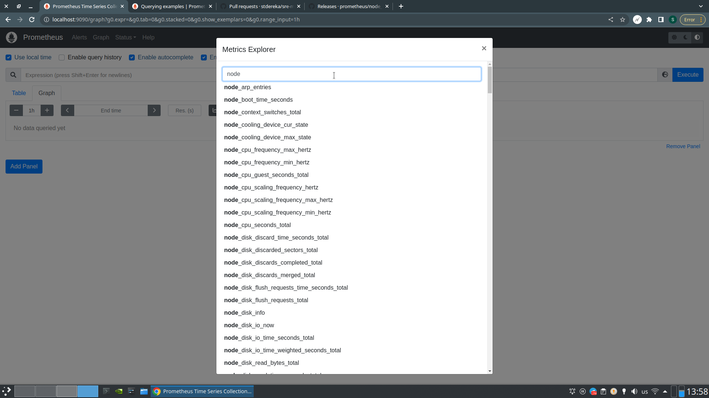
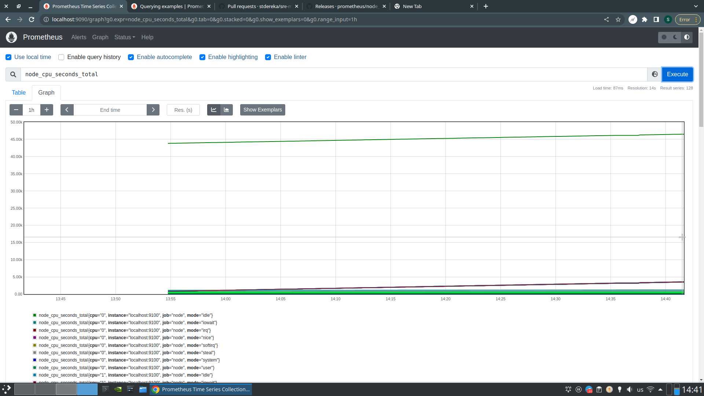
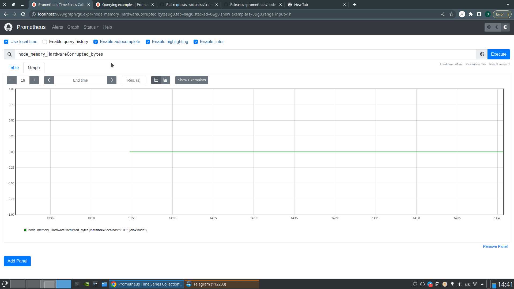
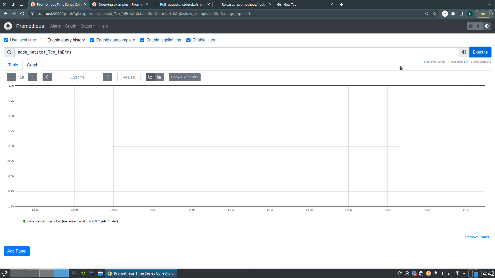

# HW 3

## Установка Node Exporter

Скрипт для установки, который я подготовил - `install.sh`. Прикладываю
скриншот первого запуска с метриками ядра Linux, которые добавились в Prometheus:


## Отключаем лишние коллекторы

Допустим, нас интересуют только метрики cpu и meminfo. Чтобы отключить всё
остальное, модифицируем юнит для systemd:

```
[Unit]
Description=Node-Exporter service
[Service]
User=prometheus
Group=prometheus
ExecStart=/usr/local/bin/node_exporter --web.listen-address=0.0.0.0:9100 --collector.textfile.directory=/opt/prometheus_exporters/textfile \
--collector.disable-defaults --collector.cpu --collector.meminfo
[Install]
WantedBy=multi-user.target
```

После перезапуска сбор метрик из cpu и meminfo коллекторов продолжился:



Остальные коллекторы (например, netstat) остановились:


## Кастомный коллектор

Будем логировать число провалившихся попыток залогниться на нашу машину.
Это поможет детектить ситуации, когда есть угроза безопасности. Метрику считает
`auth-fail.sh`. Чтобы считать регулярно, занёс в crontab.
