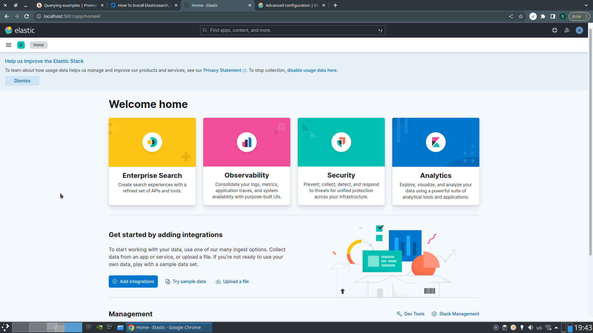

# HW 5

## Установка Elasticsearch и Kibana

Прикладываю скриншот заглавной страницы интерфейса Kibana. В основном,
пользовался материалами семинара (`install.sh`). Также попробовал развернуть
Elasticsearch и Kibana с использованием официального докер-образа.
Это гораздо удобнее, а также хорошо вписывается в качестве отдельного сервиса
в Docker Compose.

