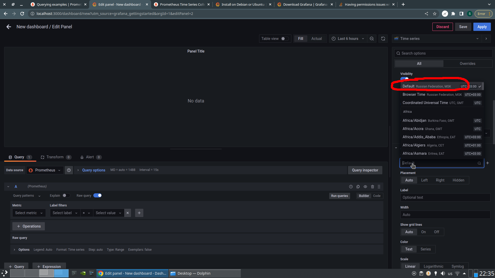
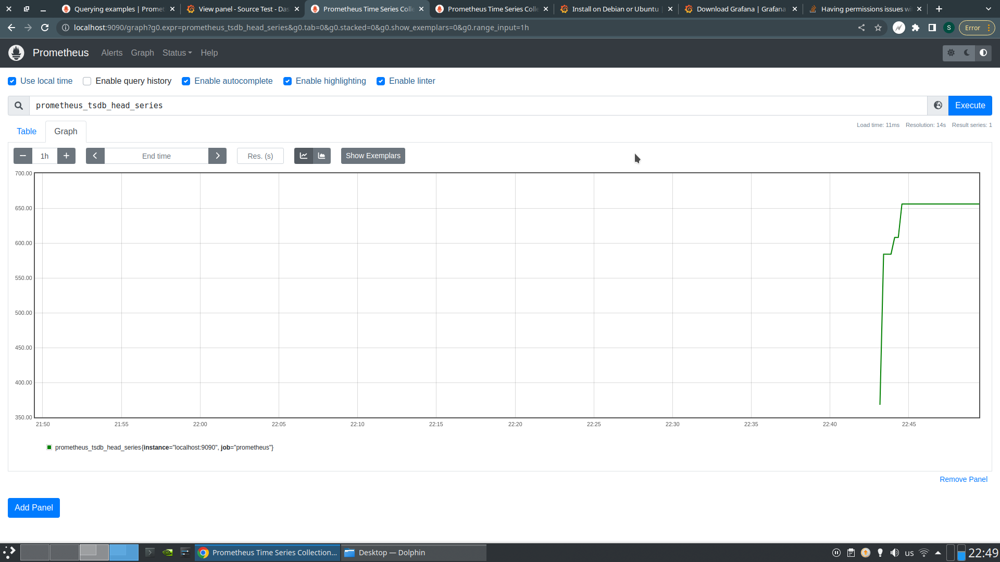

# HW 7

## Установка Grafana

Следуя инструкции с офсайта, я подготовил скрипт `install.sh`.
Прикладываю скриншот с первого запуска:


## Настройка

Для выставления требуемых настроек потребовалость внести следующие изменения
в `/etc/grafana/grafana.ini`:

```yaml
[dashboards]
versions_to_keep = 30
[users]
default_theme = dark
[date_formats]
default_timezone = Europe/Moscow
```

После перезапуска настройки применяются:



## Смотрим на метрики

Подключим в качестве сурса Prometheus и выведем `prometheus_tsdb_head_series` в Grafana:


В задании просят также посмотреть чем-то отличным от Grafana. Построим
тот же самый график в самом Prometheus:


